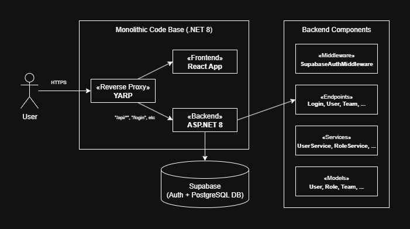

# 🏗️ Badgeur - Documentation de la Stack Technique

## Table des Matières

1. [Aperçu du Projet](#1-aperçu-du-projet)
2. [Architecture](#2-architecture)
3. [Stack Frontend](#3-stack-frontend)
4. [Stack Backend](#4-stack-backend)
5. [Base de Données et Authentification](#5-base-de-données-et-authentification)
6. [Infrastructure et DevOps](#6-infrastructure-et-devops)
7. [Stratégie de Tests](#7-stratégie-de-tests)
8. [Sécurité](#8-sécurité)

---

## 1. Aperçu du Projet

**Badgeur** est une plateforme complète de gestion du temps et des ressources humaines conçue pour les environnements bancaires et d'entreprise. L'application offre :

- 🕐 **Suivi du Temps (Pointage)** - Système de pointage entrée/sortie des employés
- 📅 **Gestion de Planning** - Planification d'équipe et demandes de congés
- 📊 **Analytique et KPIs** - Moyennes glissantes, statistiques des heures de travail
- 🚗 **Réservation de Ressources** - Réservations de véhicules et de salles
- 🎫 **Tickets de Support** - Gestion des tickets IT et RH
- 🔐 **Sécurité MFA** - Authentification multifacteur via TOTP
- 👥 **Gestion d'Équipe** - Tableaux de bord Manager/RH

---

## 2. Architecture

### Architecture de Haut Niveau



### Pourquoi cette Architecture ?

| Composant | Choix | Justification |
|-----------|-------|---------------|
| **Reverse Proxy** | YARP (Yet Another Reverse Proxy) | Solution native .NET, simplifie CORS, fournit un point d'entrée unique |
| **Conteneurisation** | Docker Compose | Environnements dev/prod cohérents, services isolés |
| **BaaS** | Supabase | PostgreSQL avec auth intégré, MFA, capacités temps réel |

---

## 3. Stack Frontend

### Technologies Principales

| Technologie | Version | Objectif |
|-------------|---------|----------|
| **React** | 19.2.0 | Framework UI - dernière version stable avec fonctionnalités concurrentes |
| **React Router DOM** | 6.28.0 | Routage côté client avec routes protégées |
| **Create React App** | 5.0.1 | Chaîne d'outils de build et serveur de développement |

### Pourquoi React 19 ?

- **Automatic Batching** - Performance améliorée pour les mises à jour d'état
- **Fonctionnalités Concurrentes** - Meilleure expérience utilisateur pendant les opérations lourdes
- **Écosystème Mature** - Support extensif de bibliothèques pour les besoins d'entreprise
- **Familiarité de l'Équipe** - Largement connu parmi les développeurs

### Bibliothèques UI

| Bibliothèque | Version | Objectif |
|--------------|---------|----------|
| **FullCalendar** | 6.1.20 | Vues calendrier pour la planification |
| **Chart.js + react-chartjs-2** | 4.5.1 / 5.3.0 | Tableaux de bord analytiques et visualisations KPI |
| **jsPDF + html2canvas** | 3.0.3 / 1.4.1 | Export PDF pour les rapports |

### Pourquoi ces Choix UI ?

1. **FullCalendar** : Calendrier de qualité entreprise avec glisser-déposer, vues multiples (jour/semaine/mois) et excellentes performances
2. **Chart.js** : Léger (~60KB), hautement personnalisable, parfait pour les tableaux de bord analytiques
3. **Pas de Framework CSS** : CSS personnalisé avec variables CSS pour le thème - flexibilité maximale pour le branding bancaire/entreprise

### Approche de Stylisation

```css
/* Variables CSS pour le Thème */
:root {
  --color-primary: #ffffff;
  --color-secondary: #1e3a8a;
  --color-background: #f5f5f5;
}
```

**Avantages** : Cohérence du thème, facilité de personnalisation, pas de dépendance externe.

### Gestion d'État

**Architecture basée sur Services** :

```javascript
// Exemple : État d'authentification
localStorage.setItem('accessToken', data.accessToken);
localStorage.setItem('userId', data.userId);
localStorage.setItem('roleId', data.roleId);
```

**Pourquoi pas Redux/Zustand ?**

- La complexité de l'application ne justifie pas une gestion d'état globale
- Le pattern singleton `authService` gère l'état d'authentification
- localStorage fournit la persistance entre les rafraîchissements de page
- Modèle mental plus simple pour l'équipe

---

## 4. Stack Backend

### Technologies Principales

| Technologie | Version | Objectif |
|-------------|---------|----------|
| **.NET** | 8.0 | Framework API avec minimal APIs |
| **C#** | 12 | Langage principal avec fonctionnalités modernes |
| **Supabase Client** | 1.1.1 | SDK de base de données et authentification |

### Pourquoi .NET 8 ?

1. **Minimal APIs** - Définitions d'endpoints claires et concises :

```csharp
app.MapUserEndpoints();
app.MapLoginEndpoints();
app.MapBadgeLogEventEndpoints();
```

2. **Injection de Dépendances** - DI intégrée avec `builder.Services.AddScoped<T>()`

3. **Performance** - Benchmarks de performance de premier ordre

4. **Prêt pour l'Entreprise** - Typage fort, DI intégrée, excellent outillage

### Pattern de Conception API

**Minimal APIs avec Extensions d'Endpoints** :

```csharp
// Services/
public class UserService { ... }
public class TeamService { ... }
public class PlanningService { ... }

// Endpoints/
app.MapUserEndpoints();
app.MapTeamEndpoints();
app.MapPlanningEndpoints();
```

**Justification** :

- Moins de code répétitif que les contrôleurs traditionnels
- Séparation claire entre logique métier (Services) et gestion HTTP (Endpoints)
- Facilité de tester les services indépendamment

### Architecture des Services

```
┌─────────────────────────────────────────────────────────────┐
│                         Endpoints                            │
│  (LoginEndpoints, UserEndpoints, PlanningEndpoints, etc.)   │
└─────────────────────────────────────────────────────────────┘
                            │
                            ▼
┌─────────────────────────────────────────────────────────────┐
│                         Services                             │
│   UserService, TeamService, PlanningService, UserKPIService │
│ BadgeLogEventService, BookingRoomService, TicketService     │
└─────────────────────────────────────────────────────────────┘
                            │
                            ▼
┌─────────────────────────────────────────────────────────────┐
│                       Auth Layer                             │
│         IAuthProvider (SupabaseAuthProvider)                │
│       IAuthRegistration (SupabaseAuthRegistration)          │
└─────────────────────────────────────────────────────────────┘
                            │
                            ▼
┌─────────────────────────────────────────────────────────────┐
│                    Supabase Client                           │
│          Database Operations, Auth, MFA                      │
└─────────────────────────────────────────────────────────────┘
```

### Packages NuGet Clés

| Package | Objectif |
|---------|----------|
| `Supabase` | Client de base de données et intégration auth |
| `Microsoft.AspNetCore.Authentication.JwtBearer` | Validation de tokens JWT |
| `DotNetEnv` | Gestion des variables d'environnement |
| `Swashbuckle.AspNetCore` | Documentation Swagger/OpenAPI |

---

## 5. Base de Données et Authentification

### Supabase (Backend-as-a-Service)

**Pourquoi Supabase ?**

| Fonctionnalité | Bénéfice |
|----------------|----------|
| **PostgreSQL** | Base de données relationnelle de qualité entreprise |
| **Auth Intégrée** | Email/mot de passe avec tokens JWT |
| **Support MFA** | Authentification à deux facteurs basée sur TOTP |
| **Row Level Security** | Contrôle d'accès granulaire |
| **Temps Réel** | Abonnements WebSocket (disponible si nécessaire) |
| **Géré** | Pas de surcharge d'administration de base de données |

### Flux d'Authentification

```
┌──────────┐     ┌──────────┐     ┌──────────┐     ┌──────────┐
│  Login   │────▶│  Verify  │────▶│   MFA?   │────▶│  Token   │
│   Form   │     │ Password │     │  Check   │     │  Issued  │
└──────────┘     └──────────┘     └────┬─────┘     └──────────┘
                                        │ Yes
                                        ▼
                                 ┌──────────┐     ┌──────────┐
                                 │   TOTP   │────▶│ Verified │
                                 │  Entry   │     │  Token   │
                                 └──────────┘     └──────────┘
```

**Implémentation MFA** :

```csharp
// Inscription MFA
public async Task<MfaEnrollResponse> EnrollMfa(string accessToken)
{
    var enrollResponse = await _client.Auth.Enroll(new MfaEnrollParams
    {
        FactorType = "totp"
    });
    // Retourne le code QR et le secret pour les apps d'authentification
}

// Vérification MFA
public async Task<MfaChallengeAndAuthResponse> VerifyMfaChallenge(
    string factorId,
    string challengeId,
    string code,
    string accessToken,
    string refreshToken)
{
    // Vérification challenge-réponse
}
```

### Modèles de Données (Exemples)

| Modèle | Champs Clés | Objectif |
|--------|-------------|----------|
| `User` | id, email, firstName, lastName, roleId, teamId | Comptes utilisateurs |
| `BadgeLogEvent` | id, userId, badgedAt | Enregistrements pointage |
| `Planning` | id, userId, date, period, demandTypeId, statut | Demandes de congés |
| `Ticket` | id, assignedTo, category, status | Tickets de support |
| `Room` | id, name, capacity, has_largescreen | Salles de réunion |

---

## 6. Infrastructure et DevOps

### Conteneurisation

**Docker Compose** orchestre trois services :

| Service | Port | Image de Base |
|---------|------|---------------|
| `frontend` | 3000 | node:25-alpine |
| `reverse-proxy` | 8080 | mcr.microsoft.com/dotnet/sdk:8.0 |
| `badgeur-backend` | Interne | mcr.microsoft.com/dotnet/sdk:8.0 |

### Fonctionnalités Docker Compose

**Hot-reload en développement** :

```yaml
develop:
  watch:
    - action: sync+restart
      path: ./backend
      target: /app
```

**Pourquoi cette Configuration ?**

- **Point d'Entrée Unique** - Le reverse proxy gère tout le trafic externe
- **CORS Simplifié** - Le proxy élimine les problèmes cross-origin
- **Expérience de Développement** - Mode watch pour le rechargement en direct
- **Prêt pour la Production** - Même architecture mise à l'échelle en production

### Reverse Proxy (YARP)

```csharp
builder.Services.AddCors(options =>
{
    options.AddPolicy("AllowFrontend", policy =>
        policy.WithOrigins("http://localhost:3000")
              .AllowAnyHeader()
              .AllowAnyMethod()
              .AllowCredentials());
});

builder.Services.AddReverseProxy()
    .LoadFromConfig(configuration);
```

**Justification** :

- Solution native .NET (pas besoin de nginx/HAProxy)
- Routage piloté par configuration
- Même langage/outillage que le backend

---

## 7. Stratégie de Tests

### Tests Frontend

| Outil | Version | Objectif |
|-------|---------|----------|
| **Jest** | 27.5.1 | Exécuteur de tests unitaires |
| **React Testing Library** | 16.3.1 | Tests de composants |
| **Cypress** | 15.8.2 | Tests E2E |

**Configuration Jest** :

```json
{
  "testEnvironment": "jsdom",
  "moduleNameMapper": {
    "\\.(css|less|scss|sass)$": "identity-obj-proxy"
  }
}
```

**Exemple E2E** (Cypress) :

```javascript
describe('Logout Flow E2E Tests', () => {
  it('should login as manager, click profile icon, and logout successfully', () => {
    cy.visit('/login');
    cy.get('#email-input').type('manager@test.fr');
    cy.get('#password-input').type('1234');
    cy.get('.login-submit-button').click();
    cy.url().should('include', '/home');
    // ... étapes de vérification
  });
});
```

### Tests Backend

| Outil | Objectif |
|-------|----------|
| **xUnit** | Framework de tests |
| **Coverlet** | Couverture de code |
| **SonarQube** | Analyse de qualité de code |

**Commande de Couverture** :

```bash
dotnet test --collect:"XPlat Code Coverage" --settings coverlet.runsettings --results-directory ./TestResults
```

### Génération de Données de Test

Le composant `SeedDataPanel` permet de générer des données de test réalistes :

```javascript
// Génère 4 événements de badge par jour ouvrable (arrivée, déjeuner, retour, départ)
const events = [arrival, lunchStart, lunchEnd, departure];
```

---

## 8. Sécurité

### Sécurité d'Authentification

| Fonctionnalité | Implémentation |
|----------------|----------------|
| **Tokens JWT** | Tokens d'accès courte durée avec capacité de rafraîchissement |
| **MFA** | Basé sur TOTP (compatible Google Authenticator, Authy) |
| **Sécurité des Mots de Passe** | Géré par Supabase (hachage bcrypt) |
| **Stockage des Tokens** | localStorage (avec considérations de sécurité) |

### Modèle d'Autorisation

```javascript
// Contrôle d'accès basé sur les rôles
const RequireAuth = ({ children }) => {
  return authService.isAuthenticated() 
    ? children 
    : <Navigate to="/login" />;
};

const RequireAdmin = ({ children }) => {
  return authService.isAuthenticated() && roleId === 2
    ? children 
    : <Navigate to="/home" />;
};
```

| ID Rôle | Nom du Rôle | Accès |
|---------|-------------|-------|
| 1 | Manager | Gestion d'équipe, approbation de planning |
| 2 | Admin/IT | Accès admin complet, gestion des tickets |
| 3 | RH | Fonctions RH, annonces, tickets |

### Sécurité API

```csharp
// Le middleware valide toutes les requêtes sauf /login et /register
public async Task InvokeAsync(HttpContext context, Client supabaseClient)
{
    if (context.Request.Path.StartsWithSegments("/login") ||
        context.Request.Path.StartsWithSegments("/register"))
    {
        await _next(context);
        return;
    }
    
    // Validation du token...
    var user = await supabaseClient.Auth.GetUser(token);
}
```

---

## Résumé

### Décisions Technologiques Clés

| Décision | Choix | Raison Principale |
|----------|-------|-------------------|
| Framework Frontend | React 19 | Maturité, écosystème, connaissance de l'équipe |
| Framework Backend | .NET 8 Minimal APIs | Performance, sécurité des types, fonctionnalités entreprise |
| Base de Données | Supabase (PostgreSQL) | Auth intégrée, MFA, service géré |
| Orchestration Conteneurs | Docker Compose | Gestion simple multi-services |
| Reverse Proxy | YARP | Native .NET, outillage cohérent |
| Tests E2E | Cypress | Standard de l'industrie, fiable |

### Compromis Acceptés

| Compromis | Risque Accepté | Atténuation |
|-----------|----------------|-------------|
| localStorage pour les tokens | Vulnérabilité XSS | En-têtes CSP, sanitisation des entrées |
| Pas de gestion d'état globale | Prop drilling dans les scénarios complexes | Pattern de service, contexte si nécessaire |
| Instance Supabase unique | Dépendance au fournisseur | PostgreSQL standard, schéma portable |

---

*Cette documentation est basée sur l'analyse du code source au 9 janvier 2026.*